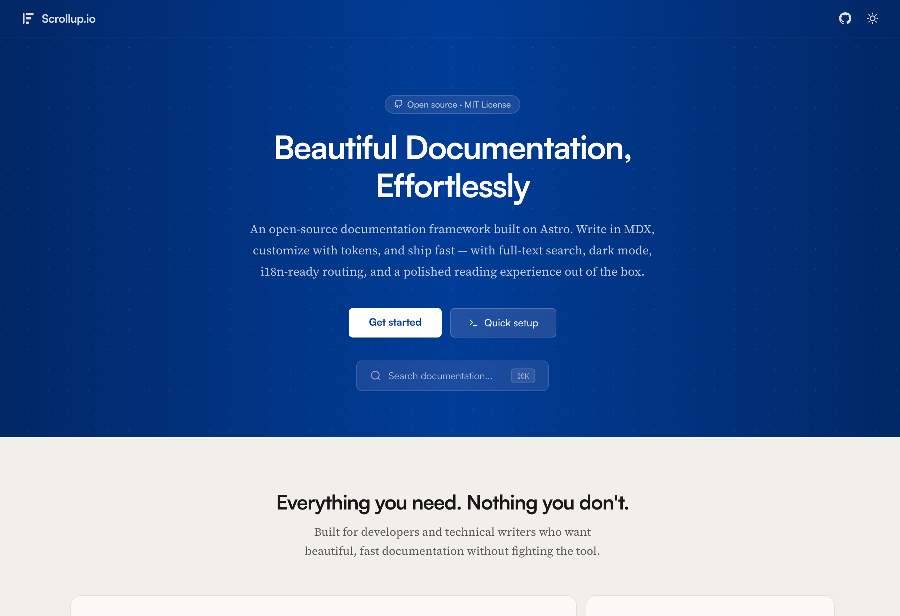

# Scrollup

[](LICENSE)
[](https://astro.build)
[](https://github.com/codejumbo/scrollup/actions/workflows/ci.yml)

Open-source documentation template. Astro 6, MDX, full-text search, light/dark/system themes, i18n routing.

## Preview

**Live site → [scrollup.io](https://scrollup.io)**



Serif body text, warm color palette, and editorial layout designed for comfortable long-form reading.

## Quick start

```sh
npm create scrollup@latest my-docs
cd my-docs
npm install
npm run dev          # → localhost:4321

npm run setup        # optional: customize site name, accent color
```

## Project structure

```
content/docs/
  en/                        # English MDX documentation pages
  fr/, es/, de/, ja/, hi/   # Locale-specific overrides
src/
  components/mdx/          # Callout, Badge, Steps, Tabs, LinkGrid, ApiEndpoint, Card, FileTree, LinkButton, LinkCard, Icon, Code, Accordion, Frame, Tooltip, ParamField
  styles/tokens.css        # Colors, spacing, layout variables
  lib/navigation.ts        # Sidebar sections + ordering
  lib/i18n.ts              # Locale definitions and UI translations
  lib/plugins.ts           # Plugin API types (ScrollupPlugin, PluginContext)
  lib/resolved-config.ts   # siteConfig merged with plugin contributions — import this in layouts
  layouts/DocsLayout.astro # Three-column docs layout
  pages/index.astro        # Landing page
  plugins/                 # Optional: your custom plugins (example-analytics.ts included)
  content.config.ts        # Content collection schema
astro.config.ts            # Astro + Expressive Code config
```

## Writing content

- Create `.mdx` files in `content/docs/en/<section>/`
- Required frontmatter: `title`, `description`, `section`, `order`
- Optional: `draft`, `deprecated`, `lastUpdated`, `author`, `tags`
- Files auto-appear in sidebar navigation at `/en/<section>/<slug>`

## Adding a section

1. Create folder: `content/docs/en/my-section/`
2. Add to `SECTION_ORDER` in `src/lib/navigation.ts`
3. Create `.mdx` files with `section: "My section"` in frontmatter

## Built-in components

All in `src/components/mdx/`:

- **Callout** — note/warning/tip aside boxes
- **Badge** — inline status pills (default/success/warning/info)
- **Steps + Step** — numbered tutorial sequences
- **Tabs + Tab** — tabbed content panels
- **LinkGrid** — responsive grid of linked cards
- **ApiEndpoint** — color-coded HTTP endpoint blocks
- **Card + CardGrid** — titled content boxes in flexible 1/2/3-col grids
- **FileTree** — visual directory tree from nested markdown lists
- **LinkButton** — styled anchor buttons (primary/secondary variants)
- **LinkCard** — full-surface clickable card link
- **Icon** — inline SVG from a 35-icon built-in set
- **Code** — programmatic code block (Expressive Code wrapper)
- **Accordion** — collapsible disclosure panels
- **Frame** — bordered media container with optional caption
- **Tooltip** — inline hover tooltips
- **ParamField** — structured API parameter rows

## Customization

- Colors and spacing: `src/styles/tokens.css`
- Fonts: update `@font-face` in `src/styles/typography.css` + files in `public/fonts/`
- Code theme: `astro.config.ts` (expressiveCode themes array)
- Content width: `--content-w` in `tokens.css`
- **Plugins** — inject CSS, `<head>` tags, and sidebar items site-wide via `siteConfig.plugins` in `src/lib/config.ts`; see `src/plugins/example-analytics.ts` for a starter
- **Component overrides** — swap Sidebar, Topbar, Footer, etc. by editing `src/lib/overrides.ts`

## Tech stack

| Layer | Technology |
|---|---|
| Framework | [Astro 6](https://astro.build) — static site generation, zero client JS by default |
| Content | [MDX](https://mdxjs.com) via `@astrojs/mdx` — Markdown with JSX components |
| Schema validation | [Zod](https://zod.dev) (built into Astro content collections) |
| Search | [Orama](https://orama.com) — client-side full-text search, index generated at build time |
| Code highlighting | [Expressive Code](https://expressive-code.com) — syntax highlighting, filenames, line markers |
| Typography | Satoshi (headings/UI), Source Serif 4 (body), JetBrains Mono (code) — self-hosted WOFF2 |
| Styling | CSS custom properties + scoped `<style>` blocks (no CSS framework) |
| Type checking | [TypeScript](https://www.typescriptlang.org) via `@astrojs/check` |
| Image processing | [Sharp](https://sharp.pixelplumbing.com) |
| Build output | Static HTML/CSS/JS → deploy anywhere |

## Deployment

```sh
npm run build        # → dist/ directory
# Deploy dist/ to any static host
```

## License

MIT
